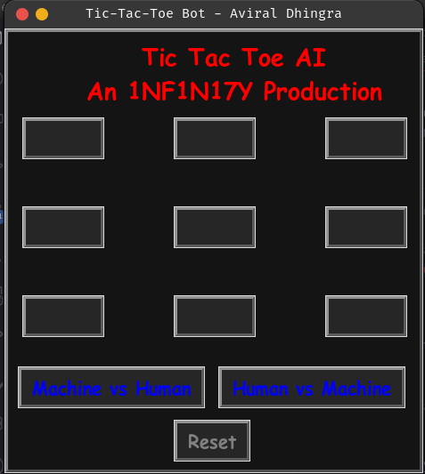
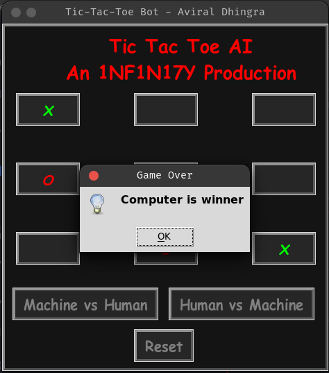

# Tic Tac Toe

> A desktop application for a commonly played game called 'tic-tac-toe' with inbuilt features to play with the machine itself...

## Table of Contents

- [Technologies Used](#technologies-used)
- [Features](#features)
- [Screenshots](#screenshots)
- [Usage](#usage)
- [Bugs](#bugs)
- [Contact](#contact)

## General Information

- Provide general information about your project here.
- What problem does it (intend to) solve?
- What is the purpose of your project?
- Why did you undertake it?
<!-- You don't have to answer all the questions - just the ones relevant to your project. -->

## Technologies Used

- Python
- Modules
  - Tkinter (TK) {Messagebox, Lable, Btn, Etc.}
  - Random

## Features

List the ready features here:

- Friendly UI
- Play with a computer (which knows all winning combinations)

## Screenshots




## Usage

Cloning in local system & Installing the requirments

```
$ git clone https://github.com/AviralDhingra/tic-tac-toe.git
$ cd tic-tac-toe
$ pip install -r requirments.txt
```

Using the CLI (terminal) based version {only tested on linux}

```
$ cd tic-tac-toe/CLI
$ python3 main.py
```

Using the UI based version (need tkinter up and running with no errors)

```
$ cd tic-tac-toe/UI
$ python3 main.py
```

## Bugs

Issues:

- The second move by the machine is grey while the others are green
- Few combinations of player winning (Eg. 7, 8, 9) are not blocked by the bot

## Contact

Created by [Aviral Dhingra](https://github.com/AviralDhingra) - feel free to contact me by [email](greatestpythoncoder287@gmail.com)!

<!-- Optional -->
<!-- ## License -->
<!-- This project is open source and available under the [... License](). -->

<!-- You don't have to include all sections - just the one's relevant to your project -->
